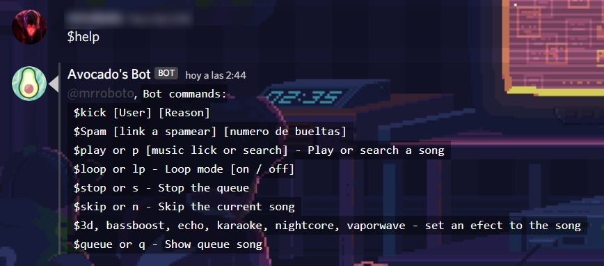
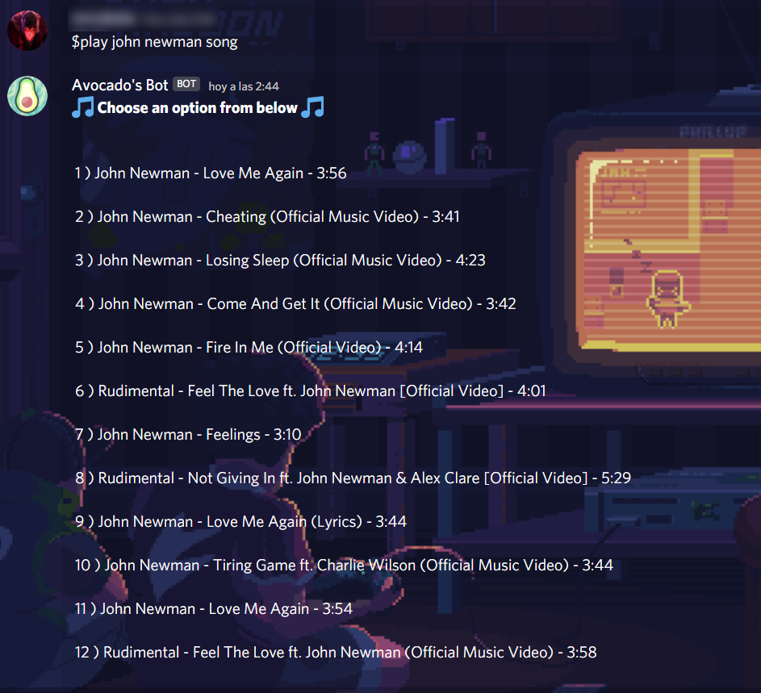
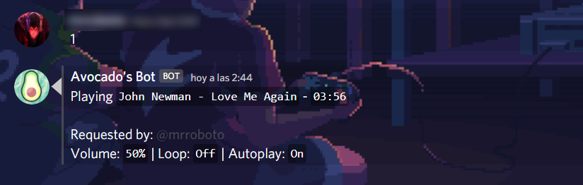

<h1>AVOCADOS NETWORK BOT 🥑</h1>

    

 
    

Welcome to the Avocados Network Bot, this Bot was developed with node.js and represents our company Avocados Network, this bot is open source, so if you want to contribute, you are free to do so.
 
## How it works?
 

$help 
 
 

$play or p [music lick or search] - Play or search a song

 
 

 $loop or lp - Loop mode [on / off]
 

$stop or s - Stop the queue
 

$skip or n - Skip the current song 
 

$3d, bassboost, echo, karaoke, nightcore, vaporwave - set an efect to the song
 

 $queue or q - Show queue of songs

## Contributing
If you are interested in reporting/fixing issues and contributing directly to the code base, please see [CONTRIBUTING.md](CONTRIBUTING.md) for more information on what we're looking for and how to get started.